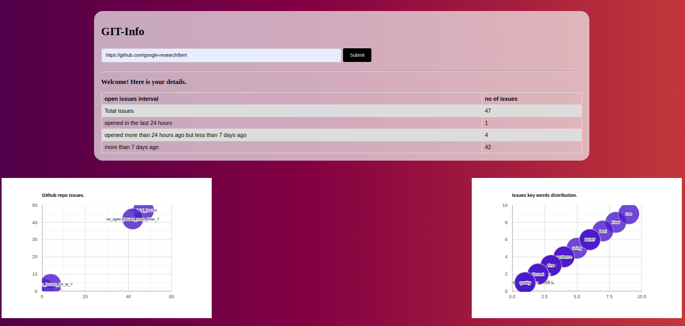
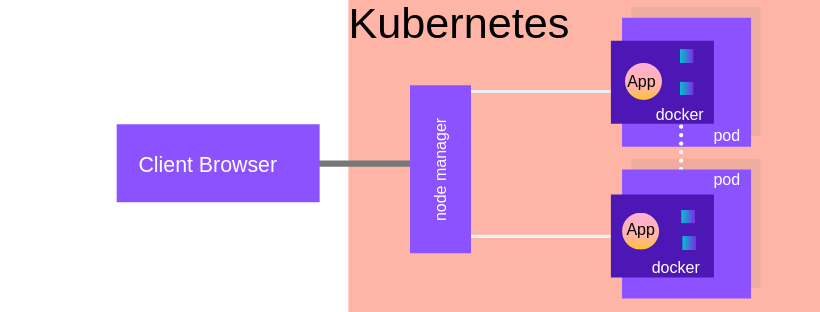

# github-open-issues

#### **About App**: This is a containerized flask app which will take any public git repo URL and will show distribution of different issues applying several condition.

#### **Endpoint of App**: http://104.197.43.20:8080/
#### **Docker Image**: gcr.io/greendeck-project/github-testing:latest

Input-page: 


Output-page: 


## Folder Structure:
```
parent-folder
└── app
|    └── dustbin (# for personal use #debugging & testing)
|    └── static
|           └── get_git_query_result.py (# function to perform git query and return resuls)
|           └── get_token_distribution.py (# function to return frequency distribution of words in request)
|
|    └── templates
|            └──welcome.html (# html page for frontend)
|
|    └── app.py (# flask app #starting)
|    └── config.py (# gunicorn config)
|    └── requirements.txt (# required packages)
|    └── uwsgi.ini (# initialization of uwsgi # ini service file)
|
|
└── screenshot-images (# contains screenshot images)
└── Dockerfile (# dockerfile to build a docker app)
└── kubernetes-config.yml (# kubernetes config file)
└── Readme.md
```
## Architecture:


**let's take down-top view:**
I have used Flask app with jinja templating. 
As Flask is not good for production server, I have used uwsgi above Flask.
Using GUNICORN configuration UWSGI is redirecting the service to flask app main module. Gunicorn helps to utlise computation resorces wisely. During the launch time it will enable the multiprocessing. and the number processes will depend on the cpu cores.
Here is the formula that calculate no of starting porocess: ```multiprocessing.cpu_count() * 2 + 1```
We can also configure the threads. As threads are lightweight it is always better to keep more thread and less process over more process and less thread. Formula to get noof threads is: ```2 * multiprocessing.cpu_count()```
