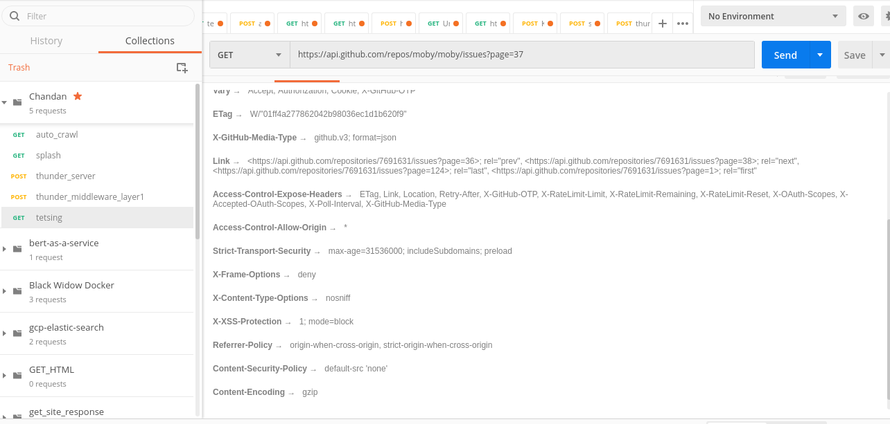
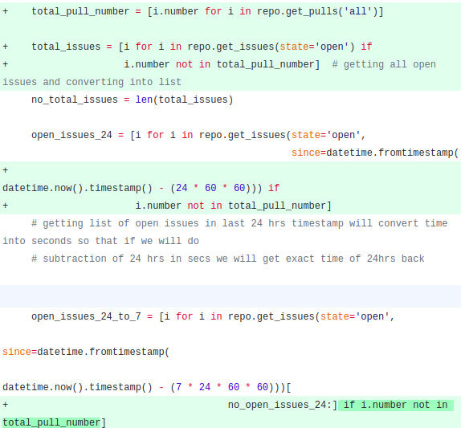
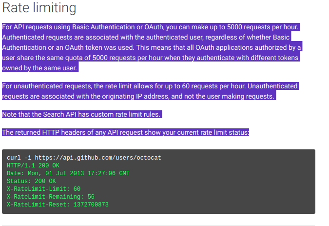
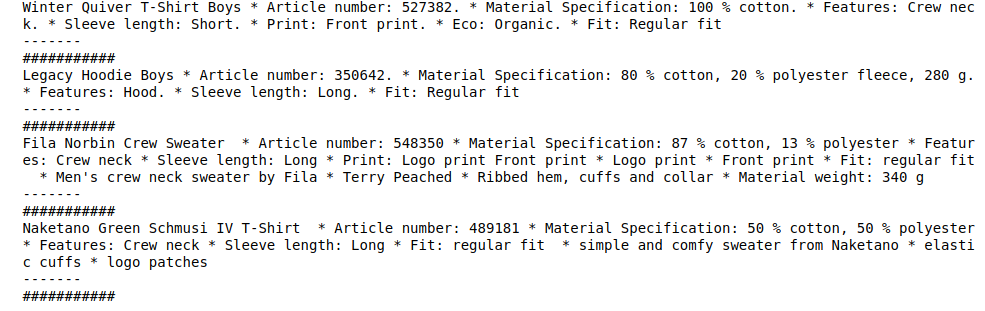

# Solving Errors regarding slow requests
# End-Point: http://104.197.43.20:8080

### problem: Previous sollution of this app was not able to collect data from repos with large no issues and the response was slow.
Target Sollution: Making it work against all repos and increasing the speed of processes.

**Thanks for reporting the error. got to know so many stuff.

#### 1) Why app was not working for "https://github.com/moby/moby" ?

Ans: This repo contains 3517 issues. I was using pygithub libraries which is internally not using multithreading and also restricting uses of several core github api functionalities.

For a single request, ***Github api returns maximum 100 responses*** and in header it returns two urls as ***next page and last page*** inside key **link**

previously I wasn't handling any of these in my code. 

#### 2) Why app was too slow ?

Ans: In my application there are 3 parts i.e: getting github data, issues distributions and ,word distributions. Here getting github data was cost expensive interms of network call.
I was giving 4 request through pygithub in a sequence manner.
.

It was making the whole process slow.

### Solution:
I have only modified "get_git_query_result.py" file.
* Removed PyGithub libary uses as it was not flexible. Instead of Pygithub used github core get request library through "Requests".
* Instead of for loop and series request call, i have used python multithreading.

compairatively This two addons helped me to increse the speed of my app much more.

processes:

** First I gave a single call to my github api and extracted first page data as well as last page number.
    using last page number I prepared all those possible URLs to extract all the data. Then in multithreading I sent the request and collected all the result.
    
** For filtering out required values again I passed all those items to a condition based function using multithreading and finally collected all needed values.

** As I was using global variables just to clean buffer after every call Wrote a function to clear those lists and values.

.

** ideal condition says for each iteration with ***n*** no of threads, list of data should be ***(10 to 20) mul n***

#### for visualization purpose I have added the actual duration in sec for a perticular request to app.
as eg:
.

### Warning:
I noticed during my work there is a rate limit for github api request. For Authenticated user its 5k/hr and for unauthenticate users its 50/hr.

.

I have not tried to solve this issue but We can solve this by applying rotating proxies.

#### * I will be extremly thankfull for your compliment on how to make it more faster and smooth.

# Thank You
